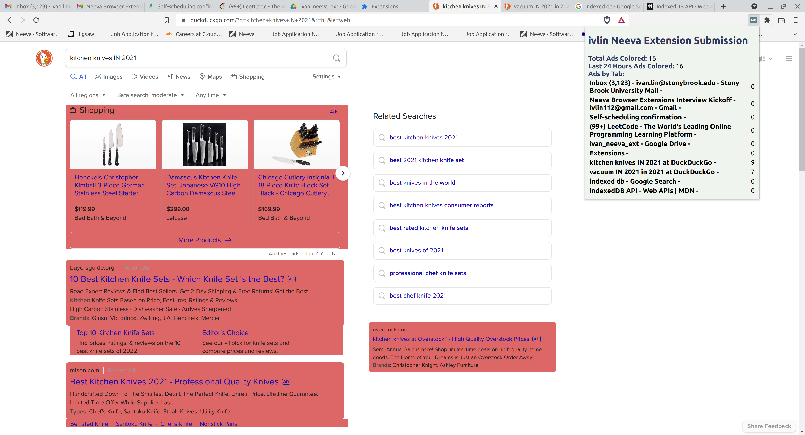

# ivlin Neeva Extension Submission
### Setup
This colors ads on the DuckDuckGo search engine. Many searches may not yield ads. In addition, make sure you turn off native browser ad-blocking features and extensions.

 1. Download the files. Unzip if downloaded as a zip file
 2. Go to chrome://extensions (or the appropriate extension location for any chrome-based browser)
 3. Turn on **Developer mode** in the top corner
 4. Click **Load unpacked**
 5. Navigate to the location you downloaded the files
 6. Accept/OK the base directory 
 7. Make sure you can easily access the extension icon by pinning it to your toolbar

### Features

 1. Keep a cumulative count of all ads colored
 2. Keep a count of all ads colored in the last 24 hours
 3. Keep a count of ads by browser tab

### Approach
#### Content script
The content script runs in the browser. It:
 1. Isolates the search query from the URL's query parameters. If it ends in "in 2021", we leave it alone. Otherwise, we add it to the query. This reloads the page to a new one with the appropriate query.
 2.  Identify ads in DuckDuckGo based on attributes assigned to the ad containers. DuckDuckGo wraps ads using the [data-testid="ad"]. This was the simplest that seemed to encapsulate everything. I chose not to do a coarser search (e.g. capture ids, classes and attributes that contain the string "ad" using [attribute*="ad"]) because this can lead to false positives and incorrect counts. I chose not to do a more precise search crawling through the page with Javascript because performance would suffer when we do not have examples of other ad indicators for DuckDuckGo that do not meet the above criteria.
 4. The query can be changed before the page finishes loading because we know the URL. After the page finishes loading, we check for ads.
 5. While I was unable to find an example of this, I did consider dynamic loading - a popular design choice is to use single-page web applications, so we cannot rely on running the ad detection every time a new page loads. We listen for page mutations and re-check on every mutation in case an ad is dynamically loaded.
 6. When ads are detected and colored, send a message to the background script containing the number of new ads and a timestamp.
#### Background script
The background script acts as a central controller. It:
 1. Loads data from storage on initialization since we require persistent storage across sessions.
 2. This consists of a counter for overall ads.
 3. This also consists of 86400 bin lists. Each bucket represents a second in 24 hours. Every time we get a new ads, we empty the bucket if the bucket is out of date, otherwise we add it into the count. We can find the total ads in the last 24 hours by summing the up to date bins.
 4. This also consists of a map of tab IDs to ads.
 5. Listens for messages.
 6. If it receives a type: READ message, it will simply send up to date information on click counts. This is currently used by the popup for display.
 7. If it receives a type: WRITE message, it will check the request for new ads and a timestamp. It will update the timeline. It will update the tab's counter. It will send a message to the popup script to update in case the popup is open.
#### Popup script
The popup script displays popup info. It:
 1. Ignores changes from the content script. Maintaining count states in background and popups can get messy, so just use background as source of truth.
 2. Updates the extension popup when the user clicks the extension button. This will send a READ request to the background script, which responds with up-to-date information to populate the popup. It gets the tab information for the current window. By using the intersection of the open tabs and the ad counter, it will display ad counts for open tabs.
 3. It also listens for messages in case new ads come up while the extension is open.
